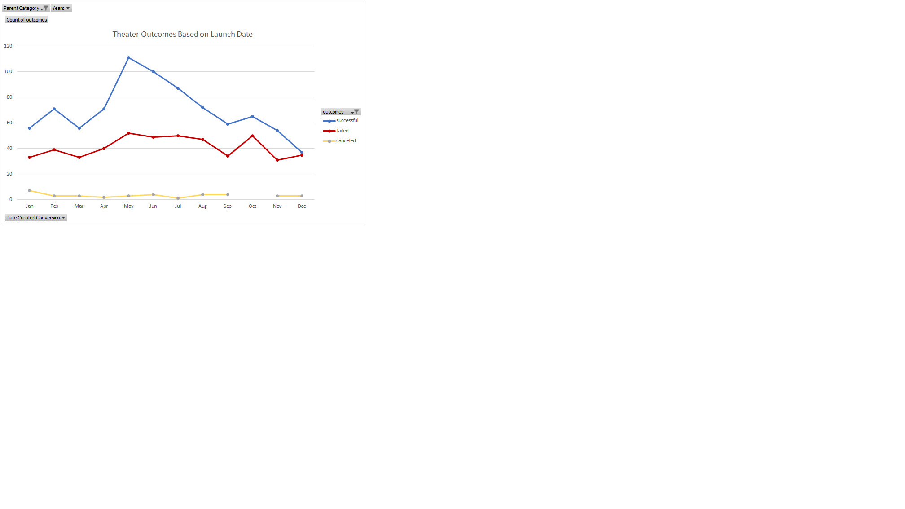
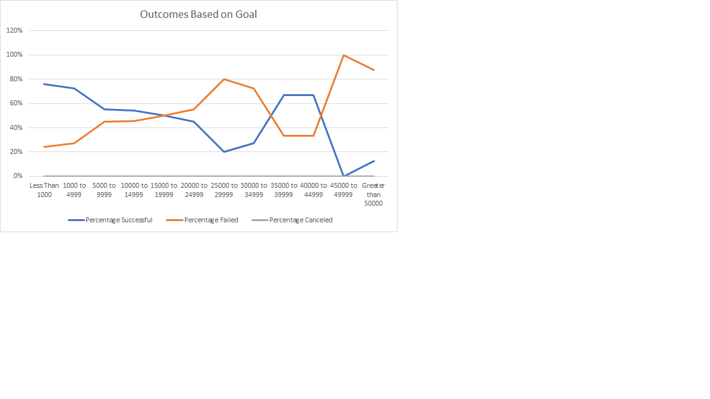

# Kickstarting with Excel

## Overview of Project:

Using Excel to analyze the Kickstarter campaign outcomes in relationship to their launch dates and funding goals.

### Purpose:

Microsoft Excel based analysis using Kickstarter campaign details for projects focused on theatre plays to gain an understanding on any outcome trends based on launch dates and funding goals before launching a similar campaign type. 

Excel filtering and formula functionalities paired with visualization capabities, displays trends and opportunities when grouping launch dates and funding goals to the campaign's outcome.

## Analysis and Challenges:

### Analysis of Outcomes Based on Launch Date

Based on Launch Date alone, theatre plays launched in May have the highest successful outcome although there is month over month decrease in campaign success after May.

---
May also sees the highest volume of failed campaign outcomes, but there is a fairly steady failure volume between May and August.  

### Analysis of Outcomes Based on Goals

Based on Goals alone, theatre plays with a funding goal less than $5000 have the highest success percentage and the highest number of projects.  But there is also an opportunity at the $35,000 to $45,000 funding goal range at a much lower number of campaigns launched.

The highest theatre play campaign failure percentages occur within the $25,000 to $35,000 and greater than $45,000 ranges.

### Challenges and Difficulties Encountered

No challenges were encountered during the analysis. But assumptions that needed to be made include:

*A given month is equivalent each year so that the campaign launch month and year is not an impactful factor to consider.

*Goal USD amounts have factored in currency conversion and that currency conversion factors in the various campaign years is not relevant.

## Results

There are at least two conclusions you can draw about the Outcomes based on Launch Date.

1) The month of May has a high number of successful campaigns and suggests to be a good month to launch a theatre campaign.
2) After May, there is a downward trend of successful theatre campaigns with the lowest number of successes in November and December.

### From the Outcomes based on Goals
1) The highest percentage of successes are associated with campaign goals $1000 or lower.
2) There is another percentage peak of successful campaigns at the $35,000-$45,000 goal range, but the percentage is based on a significantly lower number of projects than the $1000 or less dollar range.

### Limitations of this dataset
1) Kickstarter is the only source used for this analysis.  Additional crowdfunding sites may provide confirm or changes to analysis findings.
2) For campaign goals higher than $25,000, the sample set used for analysis is significantly lower than the number of projects with goals less than $25,000.

### Possible additional tables and/or graphs that we can be created are:

*Country based breakdown of outcome to understand if any country has higher success rates

*Pledge based breakdown to determine if there is an optimal tiered pledge amount including calculation average donation amount

*Subcategory view for the Theatre to understand campaign volumes for the subcategories

*Campaign Duration from launch date to Deadline date to determine if there is an optimal duration
